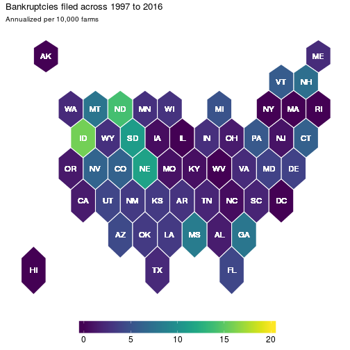

*This post was partly inspired by a [Bob Rudis hexbin state map post](https://rud.is/b/2015/05/15/u-s-drought-monitoring-with-hexbin-state-maps-in-r/) and thinking about this across time -- which is a great application of [David Robinson's gganimate package](https://github.com/dgrtwo/gganimate) in R.*

# Maps and Their Frustrations

A few months ago, I was struggling to understand a data problem. The specific problem isn't too important here, but it can be loosely characterized as trying to figure out how and why farmer bankruptcy rates vary across time and space. Before I started to think about what factors may cause bankruptcy rates to vary either spatially or temporally, I wanted to know what these bankruptcy rates looked like. The data that's available on this topic is from the [United States Courts](http://www.uscourts.gov/statistics-reports/caseload-statistics-data-tables?tn=&pn=All&t=38&m%5Bvalue%5D%5Bmonth%5D=&y%5Bvalue%5D%5Byear%5D=) website. There's a few different tables of information, but I had table F-2 data at the district level going back to 1997. Districts are basically States or sub-divisions of States and look as such:


Since I have District level data, my first inclination was to produce a [choropleth](https://bl.ocks.org/mbostock/4060606). My initial thoughts were:

1. Plotting raw count data is usually a bad idea because they generally mimic population density. I know that farms aren't distributed equally across the US, which likely implies bankruptcies won't be equally distributed. The only reason I'm looking at bankruptcy rates is to evaluate the financial conditions of an area, I don't want a map of farm activity. So I need to put this in terms of rates.
2. In the same vein as above, I know a bit about [projections of spatial data](http://www4.ncsu.edu/~rdinter/Spatial/topic3.html). I need to try and present a visually pleasing representation of the United States and have visible states here. Something like an [Albers Projection](http://desktop.arcgis.com/en/arcmap/latest/map/projections/albers-equal-area-conic.htm) should be nice as it makes states proportional to the area they occupy.
3. As this is a choropleth, I need a color scale that reflects intensity well and is robust to all kinds of color blindness. Enter the [viridis scale](https://cran.r-project.org/web/packages/viridis/vignettes/intro-to-viridis.html) which is also a great package in R.

With all this in mind, my first crack at figuring out what bankruptcy rates look like I applied a few R techniques. Grab a county-level shapefile, aggregate the counties up to the district level, project the spatialpolygons to Albers, and plot the district level map. The end result seemed kind of nice:


This seems fine, although there really aren't many farmer bankruptcy filings over time, so it's actually reasonable to check out what the total values would look like as opposed to the filing rates as above:


These are OK for a static representation of bankruptcies, which is what one would be limited to with an academic publication. But if you're presenting this stuff, well there's more information hidden in the data that these figures cannot convey.

# Animation

One thing that is lacking with these two maps is that they don't convey any temporal relationship. This would be fine if there wasn't much variation across time, except there is a fair amount due to changes in bankruptcies law. So because of this, I turned to the `gganimate` package to create a gif of bankruptcies over time:


```r
# Animate ..., uncomment below if you don't have the gganimate package
# devtools::install_github("dgrtwo/gganimate")
library(gganimate) # this package makes the .gif by utilizing "frame"

gg_anime <- j5 %>% 
  group_by(DISTRICT, FISCAL_YEAR) %>% 
  summarise(b_rate = (10000)*sum(CHAP_12, na.rm = T) /
              mean(farms, na.rm = T),
            farms  = mean(farms, na.rm = T),
            acres  = mean(acres, na.rm = T)) %>%
  right_join(gg_base)

anim <- ggplot(gg_anime, aes(long, lat, group = group)) +
  geom_polygon(aes(fill = b_rate, frame = FISCAL_YEAR), color = "black") +
  geom_path(data = gg_state, color = "white") +
  labs(title = "Bankruptcies filed in", 
       subtitle = "Annualized per 10,000 farms") +
  scale_fill_viridis(limits = c(0,10), oob = squish) +
  theme(panel.background = element_blank(),
        panel.grid = element_blank(),
        axis.line = element_blank(),
        axis.title = element_blank(),
        axis.ticks = element_blank(),
        axis.text = element_blank(),
        legend.position = "bottom",
        legend.title = element_blank(),
        legend.key.width = unit(2, "cm"),
        legend.text = element_text(size = 14),
        plot.title = element_text(size = 20),
        plot.subtitle = element_text(size = 14))
gg_animate(anim)
```


At first glance, I think this turns out to be a pretty good visualization for bankruptcies over time. We've got spatial and temporal variation and it's displayed in a manner that can convey them. But, does it really? The more I dug into the data the more I found this graphic to be misleading.

# Hexbins

If you've got an eagle eye, then you can spot Massachusetts in the animation above as an anomaly. But if you're a regular Joe like me, then this is hardly visible. In fact, because Massachusetts is such a small state you probably didn't even notice it. And it's true that there is not much farming in the Northeast, but the anomaly that is Massachusetts farmer bankruptcies remains even if number of farmers is accounted for.

This had me thinking, this is a scenario where I'd like to have each state equally represented but also preserve the rough spatial relationship. I had previously seen a blog post from [Bob Rudis](https://twitter.com/hrbrmstr) where he utilized hexbins with respect to drought conditions.

So why not apply this particular cartography technique, but to farmer bankruptcies to illustrate the problem that is Massachusetts? One valid argument is that the court districts are the level of interest here, so I'm going to have to sacrifice some accuracy in order to effectively point out the particular data issue related to Massachusetts.


```r
library(rgdal)

us      <- readOGR("usa_hex.geojson", "OGRGeoJSON")
centers <- cbind.data.frame(coordinates(us), as.character(us$st_abb))
names(centers) <- c("x", "y", "id")

us_map  <- fortify(us, region = "st_abb")
us_map$ST_ABRV <- us_map$id

banks_state <- j5 %>% 
  select(STATE, FISCAL_YEAR, TOTAL_FILINGS:NB_CHAP13, farms) %>% 
  group_by(FISCAL_YEAR, STATE) %>% 
  summarise_all(funs(sum(., na.rm = T))) %>% 
  mutate(ST_ABRV = state.abb[match(STATE, toupper(state.name))],
         ST_ABRV = ifelse(STATE == "DISTRICT OF COLUMBIA", "DC", ST_ABRV))

hex_map_data <- as.tbl(us_map) %>%
  full_join(banks_state) %>%
  left_join(centers) %>%
  filter(!is.na(long))

hex_map_data %>% 
  group_by(long, lat, order, hole, piece, id, group, ST_ABRV, STATE, x, y) %>% 
  summarise_all(funs(sum(., na.rm = T))) %>% 
  arrange(order) %>% 
  ggplot(aes(long, lat)) +
  geom_polygon(aes(group = group, fill = 10000*CHAP_12 / farms),
               colour = "white") +
  geom_text(aes(label = id, x = x, y = y), color = "white", size = 4) +
  labs(title = "Bankruptcies filed across 1997 to 2016", 
       subtitle = "Annualized per 10,000 farms") +
  scale_fill_viridis(limits = c(0,10), oob = squish) +
  theme(panel.background = element_blank(),
        panel.grid = element_blank(),
        axis.line = element_blank(),
        axis.title = element_blank(),
        axis.ticks = element_blank(),
        axis.text = element_blank(),
        legend.position = "bottom",
        legend.title = element_blank(),
        legend.key.width = unit(2, "cm"),
        legend.text = element_text(size = 12))
```



Now each state is equally represented and now it is clear that Massachusetts is an outlier. But has this always been the case? Well not necessarily. So let's apply the animation methods with this hexbin map to get a clearer picture:


```r
p <- ggplot(hex_map_data, aes(long, lat, frame = FISCAL_YEAR)) +
  geom_polygon(aes(group = group, fill = 10000*CHAP_12 / farms),
               colour = "white") +
  geom_text(aes(label = id, x = x, y = y), color = "white", size = 4) +
  labs(title = "Bankruptcies filed in",
       subtitle = "Annualized per 10,000 farms") +
  scale_fill_viridis(limits = c(0,10), oob = squish) +
  theme(panel.background = element_blank(),
        panel.grid = element_blank(),
        axis.line = element_blank(),
        axis.title = element_blank(),
        axis.ticks = element_blank(),
        axis.text = element_blank(),
        legend.position = "bottom",
        legend.title = element_blank(),
        legend.key.width = unit(2, "cm"),
        legend.text = element_text(size = 14),
        plot.title = element_text(size = 20),
        plot.subtitle = element_text(size = 14))
gg_animate(p)
```


And here, we get a nice picture of state level variation in farmer bankruptcy rates. Which was a lesson to me in recognizing that there's many ways to visualize your data. And this has had further implications for how I have decided to model farmer bankruptcy rates that I might not have considered before I fully delved into the data.

Hopefully you found this to be a helpful exercise.

*Source code for this specific .Rmd file can be found in my [github repository](https://github.com/rdinter/rdinter.github.io/blob/master/_drafts/hexbin-animation.Rmd) while all the R code and data files necessary to reproduce these maps can be found in its [accompanying folder](https://github.com/rdinter/rdinter.github.io/tree/master/_drafts/hexbins) below that directory.*
